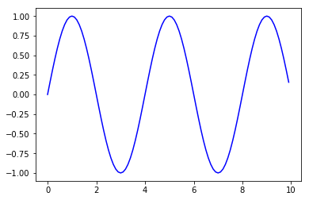

```python
import numpy as np
import math
from matplotlib import pyplot as plt
x = np.arange(0,10,0.1)

```

Output is calculated through list comprehension.


```python
y = [math.sin(0.5*elm*math.pi) for elm in x]
```

Print y values:


```python
plt.plot(x,y,'b',);
```


    [<matplotlib.lines.Line2D at 0x7f2ed14debe0>]




